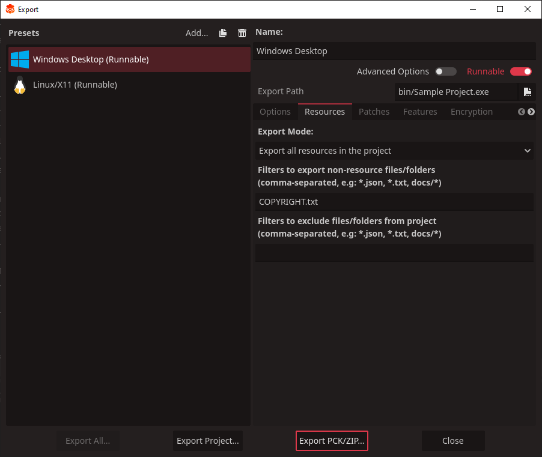

# Getting Started

This file will give you basic setup instructions so you can use the License
Dialog for Redot addon in your game or other project.

It is recommended that you read this document in a Markdown reader or
[on the project's GitHub][read-on-gh], as it contains embedded images and
hyperlinks which will provide you with visual aids and additional information.

[read-on-gh]: https://github.com/swashdev/redot-license-dialog/blob/4.x/docs/GETTING_STARTED.md

## Before Beginning

This documentation assumes you have a basic grasp on how to use the Redot Engine
editor.  If you don't know how to use the Redot Engine editor, I recommend you
read the [Redot Engine documentation][redot-docs].

[redot-docs]: https://docs.redotengine.org/en/stable/

## Basic Setup


If you haven't already, start by downloading the project.  The only files you
really need are `license_dialog.gd` (the script file) and `license_dialog.tscn`
(the scene file for the `LicenseDialog` node) from the addons folder.  
Despite this addon and sample project being public domain software, you may
need to retain attribution and licensing notices in some jurisdictions, so I
strongly recommend including the `COPYRIGHT.txt` file as well, especially if
you intend for your project to be open-source.

Drop the files into your Redot Engine project folder.  Although you can place
them in any folder you wish, I recommend keeping them in the
`addons/swashberry/license_dialog` folder that they came in.  There are two
main reasons for this:

1. It is already standard practice for Godot Engine and Redot Engine projects
   to include third-party assets in the `addons` folder, and...

2. By keeping the files in this folder, you avoid having to correct their
   references to each other in your own project.

If you want them to be in different folders, I recommend moving them to the
desired locations from within the Redot Engine editor by right-clicking
them in the FileSystem dock and clicking "Move To."  If you do it this way, the
Redot Engine will automatically fix references to the script file within the
`LicenseDialog` scene for you.

If you want to, you can now rename the script and scene files by
right-clicking them in the FileSystem dock and clicking "Rename."  This will
also automatically update references for you.  For the purposes of this
documentation, we will assume that the files are still named
`license_dialog.gd` and `license_dialog.tscn`.

### Setting Up Project Information

After you've got the scene and script files where you want them in your project
folders, it's time to give the `LicenseDialog` node any information it needs
about your project.

It is best practice to create an instance of the `LicenseDialog` scene (the
one from the `license_dialog.tscn` file in whichever scene you want it to pop
up in (say the main menu, for example), but you can also edit the
`license_dialog.tscn` file directly if you wish, since you should only need one
anyway.

However you choose to do it, open up the `LicenseDialog` scene in the Redot
Engine editor and look in the Inspector dock.  By default, this dock will be
in the upper-right in the "Inspector" tab.  You'll notice that it says
`LicenseDialog` at the top, the default name for the root node of this scene.
You can rename it if you wish, but for our purposes we'll assume you let it
keep its default name.


Under "Script Variables" you'll see some variables which you can modify by
typing some values into some text boxes.

#### Project Name

This is the name of your project, which will be used to label buttons in the
`LicenseDialog` which show attribution information for your project.

If you leave this field blank, the `LicenseDialog` will use the name which is
stored in your project file, so you don't need to do anything here unless you
want the name of your project to be displayed differently in the list of
attribution notices than it would be normally.

#### Copyright File

This is a path which refers to a file storing copyright information for your
project.  The `LicenseDialog` will look for a file stored in this location which
contains all of the information it needs to display attribution notices and
license texts for your project (*not* the Redot Engine).

The file in question needs to be formatted in a specific way in order for the
`LicenseDialog` to read it properly.  More detailed information will be given in
future versions of this documentation, but for now you can use
[the sample COPYRIGHT.txt][sample-copyright-file] included with the addon or
[the Redot Engine's COPYRIGHT.txt][redot-copyright-file] as
a reference, or refer to the format specification
[here][Debian copyright file format].

[sample-copyright-file]: ../COPYRIGHT.txt
[redot-copyright-file]: https://github.com/Redot-Engine/redot-engine/blob/master/COPYRIGHT.txt
[Debian copyright file format]: https://www.debian.org/doc/packaging-manuals/copyright-format/1.0/

**Note:**
Strictly speaking, you don't _need_ to include a copyright file with your
project.  However, I recommend that you do so, especially if you are using
third-party assets in your project, as you can take advantage of the License
Dialog for Redot addon to display licensing information for your project,
including third-party assets, as well as the Redot Engine.  
If you choose not to include a copyright file, leave the Copyright File variable
blank.  If you specify a file which does not exist, your project will spit out a
warning when it is run letting you know that the `LicenseDialog` could not find
it.

**Helpful Tip:**
If you choose not to include a copyright file, you can slim down your scripting
a lot by deleting the `_read_copyright_file` function and any references to it
from the `license_dialog.gd` file, as this is the longest function in that
script.

##### Embedding the Copyright File

The `COPYRIGHT.txt` file is convenient for attribution and licensing purposes,
but it's designed to be machine-readable rather than human-readable, so you may
feel that there's no reason to include it as a separate file in the project.

Fortunately, Redot allows us to embed this file in the exported binary so that
you don't have to include a copy of it with every distribution.  All you have
to do is set the copyright file's name so that it begins with `res://`, as if
it's any other imported resource, and include it in your project's export
template.

To include the copyright file in your export template, open the export template
in the "Export Project" menu, navigate to the "Resources" tab, and include the
name of the file under "Filters to export non-resource files/folders" as in
the screenshot below.



### Implementing the Popup

The `LicenseDialog` node is a node of type `Window` (like the windows used by
desktop applications), a class that comes packaged with the Godot Engine which
is used to display popup windows.

To add the `LicenseDialog` to your project, add it to another node, perhaps
containing the main menu.  After this, you can show it to the user by simply
adding a button which causes the window to pop up.

Here's an example function from a main menu which is linked to the "pressed"
signal from a `Button` node:

```gdscript
# The "Legal Stuff" button has been pressed.  This will open a dialog box
# containing licensing information.
func _on_LegalStuffButton_pressed():
	$LicenseDialog.popup_centered()
```

You can find more information about the `Window` class by visiting its page in
[the Redot Engine documentation][redot-window-docs].

[redot-window-docs]: https://docs.redotengine.org/en/stable/classes/class_window

**Helpful Tip**:
You can change what type of node the `LicenseDialog` is by right-clicking it and
selecting "Change Type."  Note that if you do this you will also have to change
what class the script in `license_dialog.gd` will inherit from; otherwise it
will not work.
